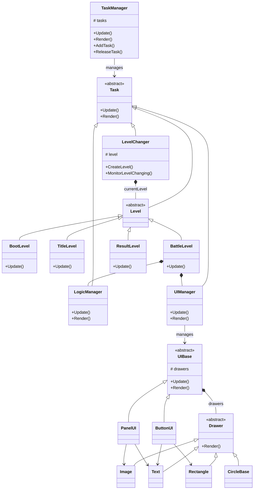

ポートフォリオ ReversiSiv3D の設計について
----

### アプリケーションの設計方針

本ポートフォリオの各クラスの関係は以下のように構成されています。(※説明の都合上LogicManagerやUIManagerなど抽象的なクラス名を使用している箇所があります。)



### 設計面で工夫した点

大きく4つの構造で実装しています。
1. タスク実行管理
2. 画面遷移管理
3. 各画面上での責務分離
4. 描画システム

**1. タスク実行管理**

本設計の中心であるタスクシステムについて説明します。このシステムの肝はTaskクラスとそれを管理するTaskManagerクラスになります。ゲーム内で使用する管理クラスなどは基本的に**Task**クラスという抽象クラスを基底クラスとして作成しています。Taskクラスにはロジック更新を実施する**Update関数**と描画を実施する**Render関数**を仮想関数として実装し、派生先で中身の処理を実装する作りにしています。必要なタイミングでタスクを作成し、TaskManagerクラスにタスクを積む(リストに追加する)ことで各タスクのロジック処理や描画処理を実行できるようになっています。TaskManagerクラスのUpdateとRenderのそれぞれの処理はメインループ内で実施しており、ゲーム全体の処理フローを一箇所に集約しています。

`.\ReversiSiv3D\ReversiSiv3D\Reversi\Feature\System\TaskManager.cpp`

```c++
    // Update関数の一部を抜粋
    void TaskManager::Update(double deltaTime)
    {
        ...
        for (const auto& [taskId, task] : taskList_)
        {
            if (!task)
            {
                continue;
            }
            if (task->IsRelease())
            {
                continue;
            }
            task->Update(deltaTime);
        }
        ...
    }

    // Render関数の一部を抜粋
    void TaskManager::Render()
    {
        const std::vector<TaskId>& renderOrder = RenderManager::GetRenderOrder();
        for (const TaskId taskId : renderOrder)
        {
            if (!taskList_.contains(taskId))
            {
                continue;
            }
            const std::shared_ptr<Task>& task = taskList_.at(taskId);
            if (!task)
            {
                continue;
            }
            if (task->IsRelease())
            {
                continue;
            }
            task->Render();
        }
    }
```

**2. 画面遷移管理**

本ゲームは起動画面(BootLevel)、タイトル画面(TitleLevel)、ゲーム画面(BattleLevel)、リザルト画面(ResultLevel)の4種類の画面で構成しており、必要に応じて自動で画面を遷移させています。この画面の切り替えの役割を担うのが**LevelChanger**クラスになります。先に説明した各画面は全て**Level**を基底クラスとして実装されており、LevelChangerクラスはこの基底クラスであるLevelを管理しています。Level本体は自身の現在の状態のみを管理し、LevelChangerはその状態を監視して必要に応じてレベルを切り替えます。

`.\ReversiSiv3D\ReversiSiv3D\Reversi\Feature\System\Level.h`

```c++
    // Levelクラスの一部を抜粋
    class Level : public Task
    {
    protected:

        enum class PhaseType
        {
            None,
            Initialize,
            Initialized,
            Running,         // 実行中
            RequestFinish,   // LevelChangerにレベル終了を通知
            GameEnd,         // ゲーム自体の終了を通知
            Finish,          // レベル内の終了処理
            Finished,        // レベル内の終了処理完了
        };

    public:

        Level(TaskId, const std::shared_ptr<TaskManager>&);
        virtual ~Level();

        void Update(double) override;

        // 次に切り替える画面(レベル)を設定する
        // この処理は派生先のレベルの処理中で指定する
        void SetNextLevel(LevelType);
        LevelType GetNextLevel() const;

        bool IsRequestFinish() const;
        bool IsGameEnd() const;
        bool IsFinished() const;
    ...
    }
```

`.\ReversiSiv3D\ReversiSiv3D\Reversi\Feature\System\LevelChanger.cpp`

```c++
    // レベル切り替えフェーズの変更処理
    void LevelChanger::ChangeCurrentLevelSwitchPhase(LevelSwitchPhaseType phaseType)
    {
        currentSwitchLevelPhase_ = phaseType;
    }

    // レベルの状態を監視して必要に応じてレベルを切り替える処理
    bool LevelChanger::MonitorLevelChanging()
    {
        // レベルが実行している際は常にこのフェーズでレベルの状態を監視し続ける

        switch (currentSwitchLevelPhase_)
        {
        case LevelSwitchPhaseType::Wait:
        {
            // ウィンドウの閉じるボタン押下した時、
            // つまりウィンドウ終了時にレベルを終了フェーズに切り替えて終了処理を実行させる
            if (IsReceivedFinishRequest())
            {
                currentLevel_->SetFinish();
                ChangeCurrentLevelSwitchPhase(LevelSwitchPhaseType::Release);
            }
            else
            {
                if (currentLevel_->IsGameEnd())
                {
                    // レベル上でゲーム終了操作が実行された時
                    // レベルを終了フェーズに切り替えて終了処理を実行させる
                    currentLevel_->SetFinish();
                    ChangeCurrentLevelSwitchPhase(LevelSwitchPhaseType::Release);
                }
                else if (currentLevel_->IsRequestFinish())
                {
                    // レベル上でレベルの切り替え要求があった時
                    // レベルを終了フェーズに切り替えて終了処理を実行させる
                    currentLevel_->SetFinish();
                    ChangeCurrentLevelSwitchPhase(LevelSwitchPhaseType::CurrentLevelRelease);
                }
            }
            break;
        }
        case LevelSwitchPhaseType::CurrentLevelRelease:
        {
            // レベルを終了フェーズが完了するまで待機する
            // レベル内部の処理が完了したら
            // 現在のレベルをTaskManagerから降ろしてロジック処理を停止する
            // ※ここでレベルの破棄は実施しない
            const bool isReleased = ReleaseLevel();
            if (!isReleased)
            {
                break;
            }
            ChangeCurrentLevelSwitchPhase(LevelSwitchPhaseType::NextLevelCreate);
            break;
        }
        case LevelSwitchPhaseType::NextLevelCreate:
        {
            // 次に切り替えるレベルの種類を取得してレベルを生成する
            const LevelType levelType = currentLevel_->GetNextLevel();
            currentLevel_ = CreateLevel(levelType);
            ChangeCurrentLevelSwitchPhase(LevelSwitchPhaseType::NextLevelInitialize);
            break;
        }
        case LevelSwitchPhaseType::NextLevelInitialize:
        {
            // 生成したレベルをTaskManagerクラスに乗せて、
            // レベルに初期化処理を実施させる
            std::shared_ptr<TaskManager> taskManager = taskManager_.lock();
            if (taskManager)
            {
                taskManager->AddTask(currentLevel_);
            }
            currentLevel_->StartInitialize();
            ChangeCurrentLevelSwitchPhase(LevelSwitchPhaseType::NextLevelInitialized);
            break;
        }
        case LevelSwitchPhaseType::NextLevelInitialized:
        {
            if (currentLevel_->IsInitialized())
            {
                currentLevel_->StartRunning();
                ChangeCurrentLevelSwitchPhase(LevelSwitchPhaseType::Wait);
            }
            break;
        }
    ...
        }
    }
```

LevelChangerクラスを用意することで各画面のロジック処理と画面遷移処理を分離し、Levelクラスの役割を明確にする他、フェードインやフェードアウトといった遷移演出も追加しやすく拡張性のある実装を実現しています。LevelクラスやLevelChangerクラスに関しても基底クラスはTaskクラスを採用しており、TaskManagerクラス上で管理されています。

**3. 各画面上での責務を分離**

各画面の処理はLevelクラスの派生先クラスで実施しますが、役割ごとにクラス化して処理の責務の分離を実施しています。管理クラスはロジック中心に処理を実施するクラスとUIのようなロジックと描画を必要とするクラスの2種類に大きく分かれます。
 - LogicManagerクラス
   - ゲーム中の進行(ターン制御)や対戦相手CPUなどロジックに特化した管理クラス
   - 本作品では以下のクラスなどを指す
     - GameMaster
     - Enemy
 - UIManagerクラス
   - ゲームに必要なUIやアセットを使用するUIBaseクラスのロジックと描画を管理するクラス
   - 本作品では以下のクラスなどを指す
     - CursorManager
     - ResultDetailManager

役割に応じてクラスを分けることで1つのクラスが肥大化することを伏せぎ、また機能拡張や機能修正を容易にするとともに修正時の影響範囲を小さく抑えることができます。

レベル上で使用するクラスはレベルの初期化処理時に生成します。

`.\ReversiSiv3D\ReversiSiv3D\Reversi\Feature\Game\BattleLevel.cpp`

```c++

    void BattleLevel::Initialize()
    {
        // リバーシの盤の状態などゲームの状態を管理するクラス
        gameState_ = std::make_shared<GameState>();
        gameState_->Initialize();

        // 背景クラス(UIManager)
        backScreen_ = std::make_shared<BackScreenDrawer>();
        AddTaskList(backScreen_);
        backScreen_->Initialize();

        // リバーシの盤上でマウスカーソル位置に表示するカーソルクラス(UIManager)
        cursorManager_ = std::make_shared<CursorManager>();
        AddTaskList(cursorManager_);
        cursorManager_->CreatePlayerCursor();
        cursorManager_->CreateEnemyCursor();
        cursorManager_->HideAllCursor();

        // 石の種類ごとに取得数を表示するクラス(UIManager)
        scoreBoardManager_ = std::make_shared<ScoreBoardManager>();
        AddTaskList(scoreBoardManager_);
        scoreBoardManager_->SetStateObserver(gameState_);
        scoreBoardManager_->CreateBoard();

        // 対戦相手(CPU)クラス(LogicManager)
        enemy_ = std::make_shared<Enemy>();
        AddTaskList(enemy_);
        enemy_->SetStateObserver(gameState_);

        // ゲームの進行役を務めるクラス(LogicManager)
        gameMaster_ = std::make_shared<GameMaster>();
        AddTaskList(gameMaster_);
        gameMaster_->SetStateObserver(gameState_);
        gameMaster_->SetCursorManager(cursorManager_);
        gameMaster_->SetScoreBoardManager(scoreBoardManager_);
        gameMaster_->SetEnemy(enemy_);
    }
```

レベル上で必要なクラスを初期化処理時に生成してTaskManagerに乗せる(リスト追加する)のですが、これらのタスクはレベル終了時にはTaskManagerクラスから降ろす必要があります。タスクを乗せたまま降ろし忘れることが無いように、基底クラスであるLevelクラスにはそのレベルで乗せたタスクのIDリストを保持する設計にしています。レベル終了処理時にこのタスクIDリストを使用して自動でリストからタスクを降ろすようになっています。

`.\ReversiSiv3D\ReversiSiv3D\Reversi\Feature\System\Level.h`
```c++
    class Level : public Task
    {
        ...
    public:

        void AddTaskList(const std::shared_ptr<Task>&);

        ...
    private:

        std::weak_ptr<TaskManager> taskManager_;
        std::vector<TaskId> addTaskIdList_;
    }
```

`.\ReversiSiv3D\ReversiSiv3D\Reversi\Feature\System\Level.cpp`
```c++

    void Level::AddTaskList(const std::shared_ptr<Task>& task)
    {
        std::shared_ptr<TaskManager> taskManager = taskManager_.lock();
        if (!taskManager)
        {
            return;
        }
        taskManager->AddTask(task);

        const TaskId taskId = task->GetTaskId();
        addTaskIdList_.push_back(taskId);
    }

    void Level::ReleaseAllTask()
    {
        std::shared_ptr<TaskManager> taskManager = taskManager_.lock();
        if (!taskManager)
        {
            return;
        }
        for (const TaskId taskId : addTaskIdList_)
        {
            taskManager->ReleaseTask(taskId);
        }
    }
```


**4. 描画システム**

UI周りの実装には少し工夫をしています。リバーシの盤や背景など描画が必要なものを実装する際には**UIBase**クラスを基底クラスとして実装しています。UIBaseクラスにはロジック処理と描画処理が実装されていますがロジック処理は派生先で実装、描画処理はUIBase上に実装しているRender関数で描画処理を実施しています。描画処理を派生先で実装せずに済むのはUIBaseクラス上で描画専用クラスである**Drawer**クラスをリスト管理して描画おり、このリストに登録されたDrawerを描画実行させているからです。このような実装にすることで派生先クラスではそのクラスの状態の制御のみを実施することを考えるだけで良くなり、ロジック処理と描画処理を完全に分離することができています。

Drawerクラスの派生クラスには画像を扱うことができる**Image**クラスや**ImageSprrite**クラス、文字を扱う**Text**クラス、矩形を扱う**Rectangle**クラスなどを用意しています。これらのクラスの中にはOpenSiv3Dライブラリで用意されている画像操作に使用するTextureクラスやTextureRegionクラス、文字を扱うFontクラス、矩形を扱うRectクラスがメンバ変数として宣言されています。Drawerクラスは単に描画処理を分離しているだけでなく、実装担当者がOpenSiv3D専用のクラスを意識せずに実装を可能とする工夫も実施しています。

Imageクラスなど必要なクラスをUIBaseクラスの派生先クラスで生成してリストに登録することで描画実行できるようにしています。

`.\ReversiSiv3D\ReversiSiv3D\Reversi\Feature\Game\UI\UIBase.h`

```c++

    class UIBase
    {
    public:

        UIBase();
        virtual ~UIBase();

        // UIManagerクラス等から呼び出して実行する関数
        virtual void Update(double) {};
        void Render();

    protected:

        // 派生先クラスから呼び出してリストに登録する
        void AddDrawable(std::shared_ptr<Drawer>);

    private:

        std::vector<std::shared_ptr<Drawer>> drawerList_;
    };
```

`.\ReversiSiv3D\ReversiSiv3D\Reversi\Feature\Game\UI\UIBase.cpp`

```c++
    // UIBaseクラスの描画処理
    // 関数の一部を抜粋
    void UIBase::Render()
    {
        for (const std::shared_ptr<Drawer>& drawer : drawerList_)
        {
            drawer->Render();
        }
    }

    void UIBase::AddDrawable(std::shared_ptr<Drawer> drawer)
    {
        drawerList_.push_back(std::move(drawer));
    }
```

Drawerクラスは描画に必要な描画位置の情報やスケール、色情報などを保持しており、UIBase側からロジック操作にて更新する必要がある場合があります。1つのリソースを共有するために毎フレーム描画を実行する基底クラス側に所有権(std::shared_ptrで宣言)を持たせ、ロジック操作側は弱参照(std::weak_ptrで宣言)として必要に応じて参照して使用する仕組みをとっています。ただしロジック処理の更新頻度が高い場合は例外的にロジック操作側にも所有権を持たせている場合があります。本来であれば設計は統一すべきですが、弱参照であるstd::weak_ptrは使用時に生存確認が必要であること一時的にと一時的に所有権を保有するためにstd::shared_ptrを生成するためのコストが発生します。ゲームのパフォーマンスに悪影響を及ぼさないようにロジック側にも所有権を持たせてコストを軽くする狙いのためこのような実装形態をとっています。

`.\ReversiSiv3D\ReversiSiv3D\Reversi\Feature\Game\UI\ScoreBoard.cpp`

```c++

    // ゲーム中に石の種類に応じてそれぞれ何枚獲得しているかを表示するボードクラス
    // ゲーム中は基本的に常に同じ位置、同じサイズで描画するものであるため、
    // ロジック処理側は弱参照、描画側に所有権を持たせる
    void ScoreBoard::Initialize(const String& boardFilePath, const String& stoneFilePath)
    {
        std::shared_ptr<Image> board = std::make_shared<Image>();
        board->LoadTexture(boardFilePath);
        const double scale{ AssetManager::GetCurrentWindowScale() };
        board->SetScale(scale);

        // 所有権は基底クラスであるUIBaseが持つ
        // 本クラスでは弱参照として保持する
        // std::weak_ptr<Image> backBoard_;
        backBoard_ = board;
        AddDrawable(std::move(board));

        std::shared_ptr<Image> stoneIcon = std::make_shared<Image>();
        stoneIcon->LoadTexture(stoneFilePath);
        stoneIcon->SetScale(scale);

        // 所有権は基底クラスであるUIBaseが持つ
        // 本クラスでは弱参照として保持する
        // std::weak_ptr<Image> stoneIcon_;
        stoneIcon_ = stoneIcon;
        AddDrawable(std::move(stoneIcon));

        // 所有権は基底クラスであるUIBaseが持つ
        // 本クラスでは弱参照として保持する
        // std::weak_ptr<Image> playerName_;
        std::shared_ptr<Text> playerName = std::make_shared<Text>();
        playerName_ = playerName;
        AddDrawable(std::move(playerName));

        // 所有権は基底クラスであるUIBaseが持つ
        // 本クラスでは弱参照として保持する
        // std::weak_ptr<Image> stoneCount_;
        std::shared_ptr<Text> stoneCount = std::make_shared<Text>();
        stoneCount_ = stoneCount;
        AddDrawable(std::move(stoneCount));
    }
```

`.\ReversiSiv3D\ReversiSiv3D\Reversi\Feature\Game\UI\BoardUI\BoardDrawer.cpp`

```c++

    // ゲーム中にリバーシの盤を描画するクラス
    // リバーシの盤もゲーム中は基本的に常に同じ位置、同じサイズで描画するものだが、
    // 今回は盤の1マス分の画像のみを使用して64マス分を座標指定して管理クラスから描画している
    // 表示座標を毎フレーム64回分更新する必要があるため、ロジック処理側と描画処理側の両方に所有権を持たせる
    void BoardDrawer::Initialize()
    {
        std::shared_ptr<Image> board = std::make_shared<Image>();

        board->LoadTexture(U"image/board.png");

        const double scale{ AssetManager::GetCurrentWindowScale() };
        board->SetColor(DefaultColor);
        board->SetScale(scale);

        // 所有権は基底クラスであるUIBaseと本クラスが保持する
        // 本クラスでの設定更新処理が頻繁に実施されるため、
        // 本クラスにも所有権を保持する
        board_ = board;
        AddDrawable(board);
    }
```


以上